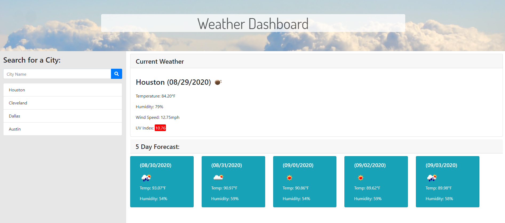

# Work Day Planner

[Click here to check out the webiste!](https://cldominy.github.io/day-planner/ "Work Day Planner")

This website was built using Bootstrap for styling and jQuery to dynamically generate a time block for each working hour in the day. Users are able to type different memos, appointments, or tasks for each hour. By clicking the save button, the user's typed notes are saved to their local storage and pulled back into the text boxes whenever they refresh or open the window again. Users can clear the calendar, clearing the current memos and their local storage, making it a great tool for scheduling one day at a timne! 

# Preview of the Website

This website was created to show user's the current date and hour by utilizing moment.js. The current date is displayed at the top and the colors of the time blocks change depending on the current time. Past hours are grey, current hour is red, and future hours are green. 

